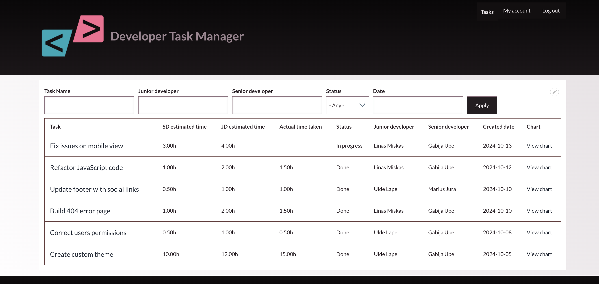
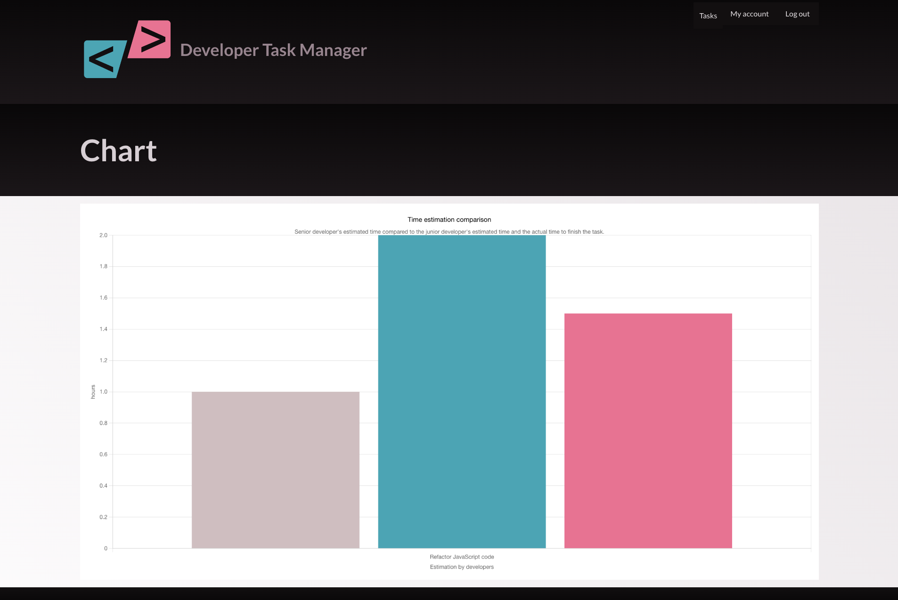

# Developer task manager

## Project overview

Drupal based Developer Task Manager allows Senior Developers or Technical Leads to create tasks, set estimated time and assign tasks to Junior Developers. Junior Developers can also add their own time estimates and, once task is completed, add the actual time taken. A chart displays a comparison of time estimates and actual time for each task.

## Roles and permissions

- Superadmin: has a full access to the system (including users, tasks views, configuration and etc.)
- Senior developers: can view, create, edit, delete tasks.
- Junior developers: can view and edit tasks.

## Main features

- Task creation and assignment can be done through content --> add content --> Task.
- All Tasks have a custom view that displays them on the homepage with key information in a table format, sorted in descending order by date.
- Tasks can be filtered by name, junior and senior developers names, status and creation date.
  - **Task view**:
  <br>
  
- In the Task List, clicking on the Task Name leads to the task's edit page.
- Next to each tasks there is a 'View chart' option. Clicking on it shows Time estimation comparison (Senior vs. Junior vs. Actual time) in a chart.
  - **Chart View**:
  <br>
  
- Superadmin is responsible for adding users, assigning them permissions and setting passwords. When users are logged in, they can view basic profile information under 'My account'.
- The design was created using the Solo Theme for its active maintenance, clean and modern design and responsive layout.

## URLs

- **Home page**: / - leads directly to Tasks Lists.
- **Task List**: /tasks - also leads to Tasks Lists.
- **Specific Task**: /[task name] - page for a specific task task.
- **Admin Dashboard**: /admin/content - for adding new tasks.
- **Login page**: /user/login - login page for users.
- **User profile**: /user/[id] - specific user profile.
- **Task Charts**: /taskscharts/[id] - view task charts.


## Future improvements

- **Custom theme**: develop a custom theme to provide a more tailored design and branding for the project.
- **Twig**: use Twig templating to customize the layout and structure of the site.

## Installation instructions

### 0. Prerequisites

Ensure you have DDEV, docker, composer and drush installed.

### 1. Get project files

- Download project files from this github repo.
- The files should include:
  - `composer.json`
  - `composer.lock`
  - `db.sql`
  - `web/`

### 2. Install dependencies

Run this command to install necessary project dependencies:

```bash
composer install
```

### 3. Set up DDEV environment

DDEV configuration:

```bash
ddev config
```

Start DDEV:

```bash
ddev start
```

### 4. Import database

Import the database into DDEV environment:

```bash
ddev import-db --file=db.sql
```

### 5. Verify DDEV set up

Verify that project is running correctly and check it's main information:

```bash
ddev describe
```

### 6. Update settings.php

settings.php file can be found here: /web/sites/default/settings.php
Add the database configuration to settings.php.
Necessary information can be get using the ddev describe command.

Example:

```bash
$databases['default']['default'] = [
  'database' => '',
  'username' => '',
  'password' => '',
  'host' => '',
  'port' => '',
  'driver' => '',
  'prefix' => '',
];
```

### 7. Clear Cache

Clear Drupal cache using Drush:

```bash
ddev drush cr
```

### 8. Acces website via web server

Web server used is Nginx as it's the default for DDEV.
By using ddev describe, you can find the URL to access your Drupal site.
Example:

```bash
https://example.ddev.site
```